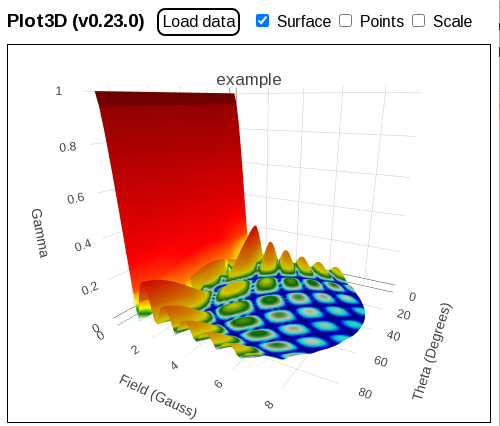

## Overview

A single-page web app for interactively exploring 3D surfaces.

The application reads x,y,z coordinates from a file and displays a colorful surface plot that can be interactively rotated and zoomed.

## Screenshot

## Getting Started

Open [plot3d.html](plot3d.html) in a browser and load 3D CSV data from a file. Data files can be dragged and dropped into the application if the host supports this.

Use a mouse, or touch, to rotate, pan and zoom.

## 3D Data File Format

3D coordinates must be stored in CSV format in x,y,z order. Lines starting with '#' and blank lines are ignored. If the first CSV row contains 3 text strings these are used to label the x,y & z axis. The file name is used as the title of the plot.

### Example 3D Data File

      # Example 3D CSV data file.      
      x-axis-label, y-axis-label, z-axis-label      
      0, 0, 0
      1.0, 2.1, 3.2
      2.3, 3.1, 4.2

## License

Distributed under the MIT License. See [LICENSE.txt](LICENSE.txt) for more information.
